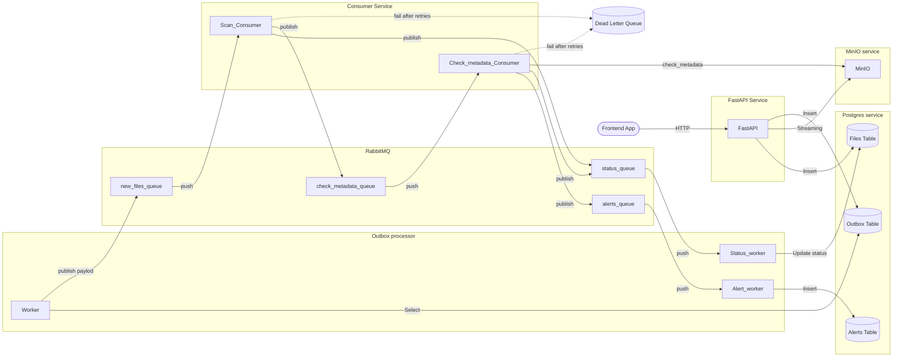

## Тестовое задание на позицию Fullstack разработчика (Python + React)

**Вводные:**
1. Здесь представлен MVP проект файлообменника. Он позволяет загружать файлы, проверяет их на подозрительный контент и отправляет алерты;
2. Репозиторий содержит в себе бэкенд и фронтенд части;
3. В обоих частях присутствуют баги, неоптимизированный код, неудачные архитектурные решения.

**Задачи:**
1. Проведите рефакторинг бэкенда, не ломая бизнес-логики: предложите свое видение архитектуры и реализуйте его;
2. (Дополнительно) На бэкенде есть возможность неочевидной оптимизации - выполните ее;
3. (Дополнительно) Разбейте логику фронтенда на слои;

**Запуск:**
заполняем .env и frontend/.env или оставляем по дефолту как в example

```docker compose -f docker-compose.dev.yml up```



